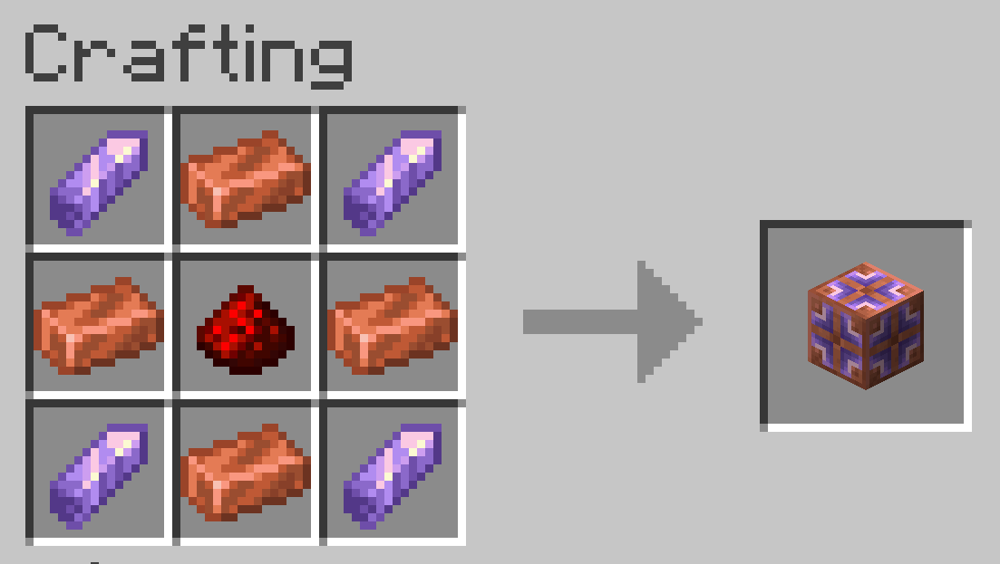

Vanilla Copper Golems will simply navigate to the nearest chest when it has something in its hand. After only 10 chests, it gives up and forgets everything it's touched in hopes of finding the right one.

This mod attempts to fix this, or at least make them more viable for larger storage rooms, while still maintaining the Vanilla behavior of "trial-and-error" if there's no knowledge about that item.

## Copper Memory Block

The new block added by this mod. Copper Golems near the block will discover it in the same way it finds chests, and will latch onto the closest one automagically.

A Memory Block does a simple task: when a Golem stores an item in a chest, it will add that chest to the memory it's latched onto. Golems later sorting the same item will check to see if the memory knows about any chests that had that item sorted into them already, and will check those first if it does. If the Golem finds that the chest no longer contains that item, it'll make sure it gets removed from the memory.

If you ever want to clear the memory, just break it!

## Why not give Golems a memory of their own?

Doing this with a block allow Golems to "communicate" in a way. If you have multiple Golems and one stores an item, other Golems can quickly realize that and go in that direction rather than having to discover that chest for themselves.

It also avoids duplicating the data for each Golem. If you have a _lot_ of them, this might actually be meaningful, even if just a little bit.
